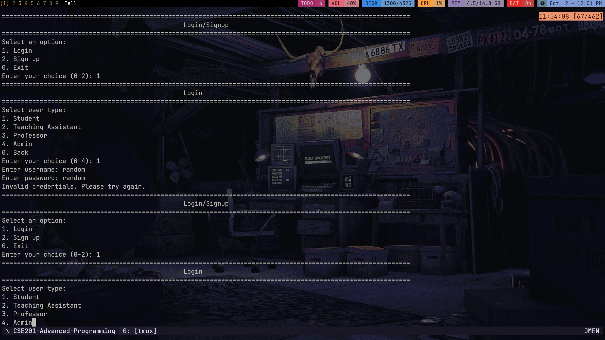

# Course Registration System

This is a Java-based Course Registration System that allows students, professors, and administrators to manage courses,
enrollments, and academic records.

## How to Run

1. Ensure you have Java Development Kit (JDK) installed on your system.
2. Compile all Java files in the project directory:
   ```
   javac *.java
   ```
3. Run the Main class:
   ```
   java Main
   ```
4. Follow the on-screen prompts to navigate through the system.

## Overview

This project is a Course Management System that allows students, teaching assistants, professors, and administrators to
manage courses, grades, and feedback. The system is designed using object-oriented principles, generic programming, and
exception handling to ensure robustness and flexibility.

## Features

- **Student Management**: Students can register for courses, drop courses, view their schedule, and submit feedback.
- **Teaching Assistant Management**: Teaching assistants can view enrolled students and grade them.
- **Professor Management**: Professors can manage courses, view enrolled students, grade students, and view feedback.
- **Admin Management**: Admins can add/remove courses, manage student records, assign professors and TAs to courses, and
  handle complaints.

## Object Classes

The system is built using several object classes to represent different entities:

- **User**: A base class for all users (students, professors, TAs, and admins).
- **Student**: Inherits from `User` and includes methods for course registration, dropping courses, and viewing
  schedules.
- **TeachingAssistant**: Inherits from `Student` and includes additional methods for viewing enrolled students and
  grading them.
- **Professor**: Inherits from `User` and includes methods for managing courses, viewing students, grading, and viewing
  feedback.
- **Admin**: Inherits from `AdminUser` and includes methods for managing courses, student records, and handling
  complaints.
- **Course**: Represents a course with attributes like course code, name, credits, and enrolled students.
- **Feedback**: A generic class to handle feedback from students.

## Generic Programming

Generic programming is used in the `Feedback` class to allow feedback of any type:

```java
public class Feedback<V> {
    private V feedback;
    private String studentEmail;

    public Feedback(V feedback, String studentEmail) {
        this.feedback = feedback;
        this.studentEmail = studentEmail;
    }

    public V getFeedback() {
        return feedback;
    }

    public String getStudentEmail() {
        return studentEmail;
    }

    @Override
    public String toString() {
        return String.format("| %-30s | %-50s |", studentEmail, feedback.toString());
    }
}
```

## Exception Handling

The system includes exception handling to ensure that the program does not crash due to unexpected inputs or errors. For
example, the `Course` class includes methods to handle exceptions when adding or removing students:

```java
public static void adminLogin(String username, String password) throws InvalidLoginException {
    for (Admin admin : admins) {
        if (admin.getEmail().equals(username) && admin.getPassword().equals(password)) {
            adminMenu(admin);
            return;
        }
    }
    throw new InvalidLoginException("Invalid credentials. Please try again.");
}
```

## Demonstration





